> 🔴 **华与华参考** · 仅供内部学习，不可直接用于客户提案

# 华与华方法模型图（AI可读版）

---

## 一、企业战略

### 1.1 企业三大原理

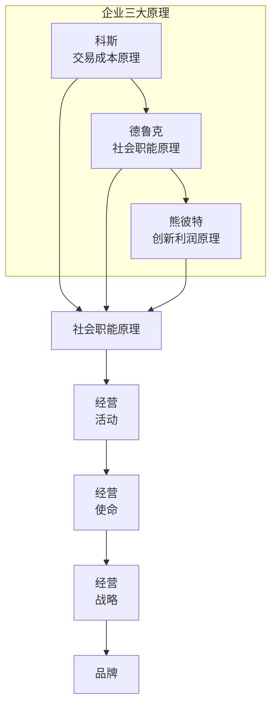

**科斯：交易成本原理**
- 企业之所以存在，是因为它降低了社会的交易成本
- 当企业内部交易成本大于外部交易成本时，企业的规模就停止扩张了

**德鲁克：社会职能原理**
- 企业是社会的器官，为社会解决问题
- 一个社会问题，就是一个商业机会

**熊彼特：创新利润原理**
- 没有创新，得到的利润是短暂的，因为对手会学习，所以利润不能持续

---

### 1.2 企业战略菱形模型

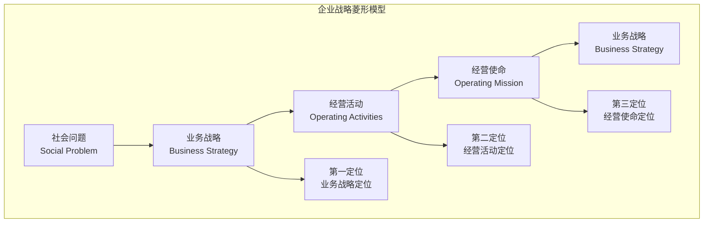

**第一定位：业务战略定位**
- 定位解决什么问题，也是业务分工定位，定位自己一生的业务

**第二定位：经营活动定位**
- 用一套独特的经营活动，实现独特价值、总成本领先和竞争对手难以模仿

**第三定位：经营使命定位**
- 第三定位支持第二定位，第二定位支撑第一定位，第一定位是最终目标

---

### 1.3 五个市场模型

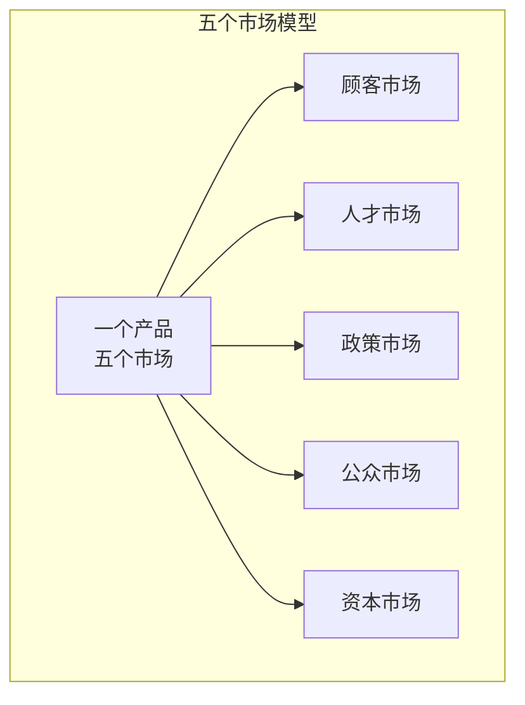

**顾客市场**：让顾客用我们的产品
**人才市场**：吸引人才，降低招聘成本，提高命中率
**政策市场**：参与行业治理，得到政府支持；能与相关政策和法规的制定
**公众市场**：成为本行业人才向往的公司
**资本市场**：成为重要的公众公司，提升企业的信赖和质量

---

### 1.4 企业价值之轮

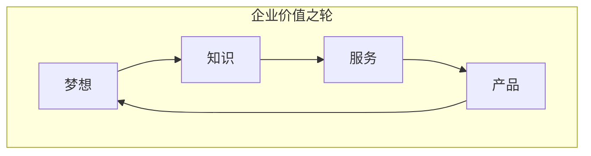

企业价值的5层模型：梦想 → 知识 → 服务 → 产品 → 体验

- **产品价值**：企业提供产品
- **服务价值**：服务创造附加价值
- **知识价值**：知识是企业的核心资产
- **梦想价值**：企业是构建梦想的组织，也是为人类创造美好回忆的组织
- **梦想价值**：所有企业都是梦想工厂，最伟大的企业，都是在某一方面代表人类的梦想

---

### 1.5 企业战略三角

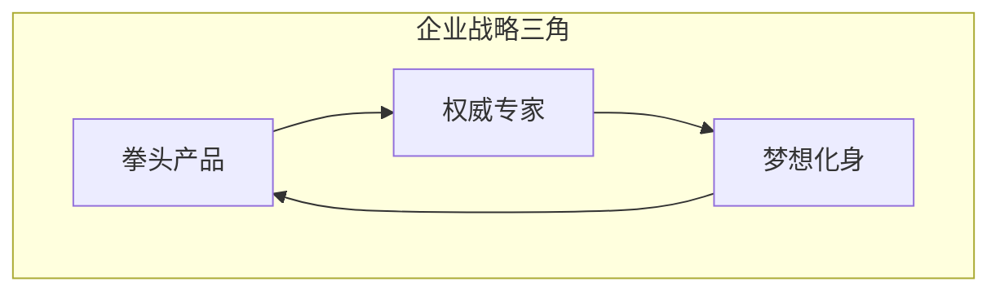

**拳头产品**：企业就是产品，任何企业、任何方面回答你的拳头产品是什么，强有力的拳头产品，会为你指明方向

**权威专家**：所谓权威对我们的意义在于权威，建立专家形象，掌控话语权

**梦想化身**：代表人类在某领域的所有追求和终极梦想，成为这一领域的梦想化身

---

### 1.6 企业价值三角

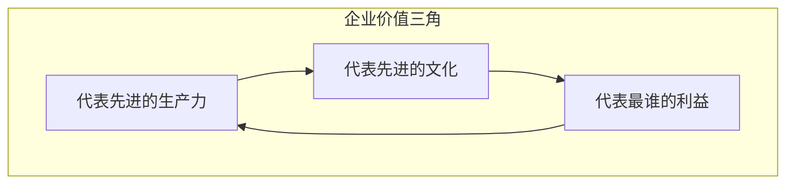

**代表先进的生产力**：代表最先进的生产力，这就是你对人类文明的贡献

**代表先进的文化**：就是先进文化的代表。你在哪一方面，代表了最先进的文化；你在哪一方面，集合了最先进的资源

**代表全人类的梦想**：代表了全人类的梦想，代表了国家的利益，顾客和社会的共同利益

---

### 1.7 定位坐标系

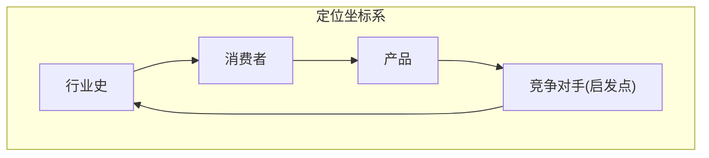

**X轴：产品** — 把产品上所有可选择的购买理由罗列出来，找出企业成功的基因，正在成功的基因决定了未来可能的机会

**Y轴：消费者** — 看到消费者的消费知识、消费观念、购买习惯和使用习惯，看到顾客对哪些品类熟悉，为消费者提供完整的购买决策信息，降低消费者的决策成本

**Z轴：行业史** — 一看行业史就知道，二看全球本行业的最佳实践，成功不是原创，成功主要靠模仿

---

### 1.8 顾客价值方阵

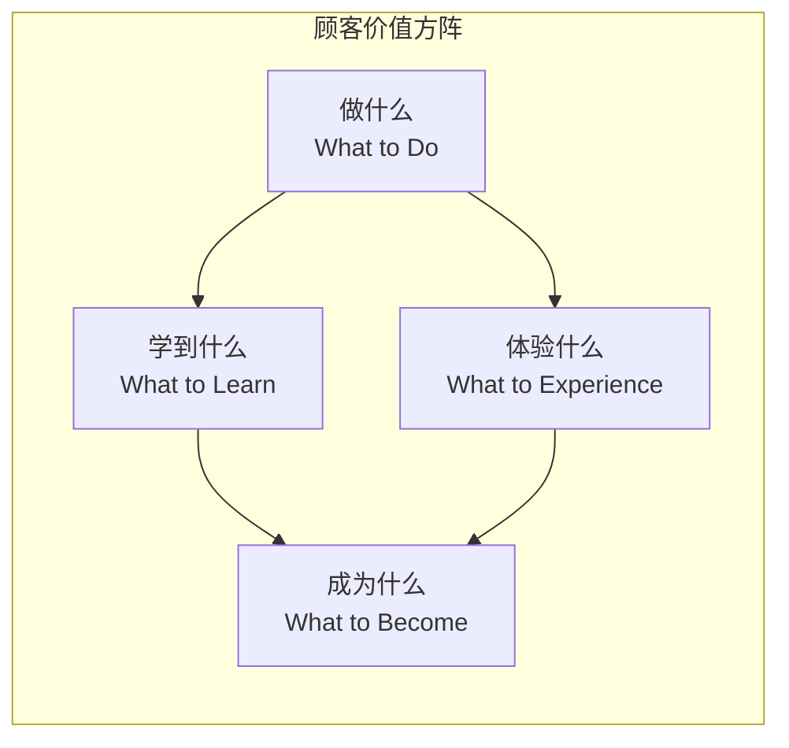

顾客在我们这里到底能得到什么，有四个方面：
1. 在这里学到了什么，顾客对自己学到什么很在意
2. 体验什么？
3. 成为什么，品牌是身份的象征
4. 做什么，品牌是身份的象征

---

### 1.9 熊彼特五个创新

| 创新类型 | 说明 |
|---------|------|
| 产品创新 | 创造一个新产品，或者给老产品一种新的特性 |
| 技术创新 | 创造一种新的生产方式 |
| 市场创新 | 开辟一个新的市场 |
| 原料创新 | 获得一个新的原料来源 |
| 组织创新 | 创造一个新的商业组织，建立或打破一种垄断 |

**创新（Innovation）** 就是把原始生产要素重新排列组合为新的生产方式，以求提高效率、降低成本的一个经济过程。

---

### 1.10 迈克尔·波特五力模型

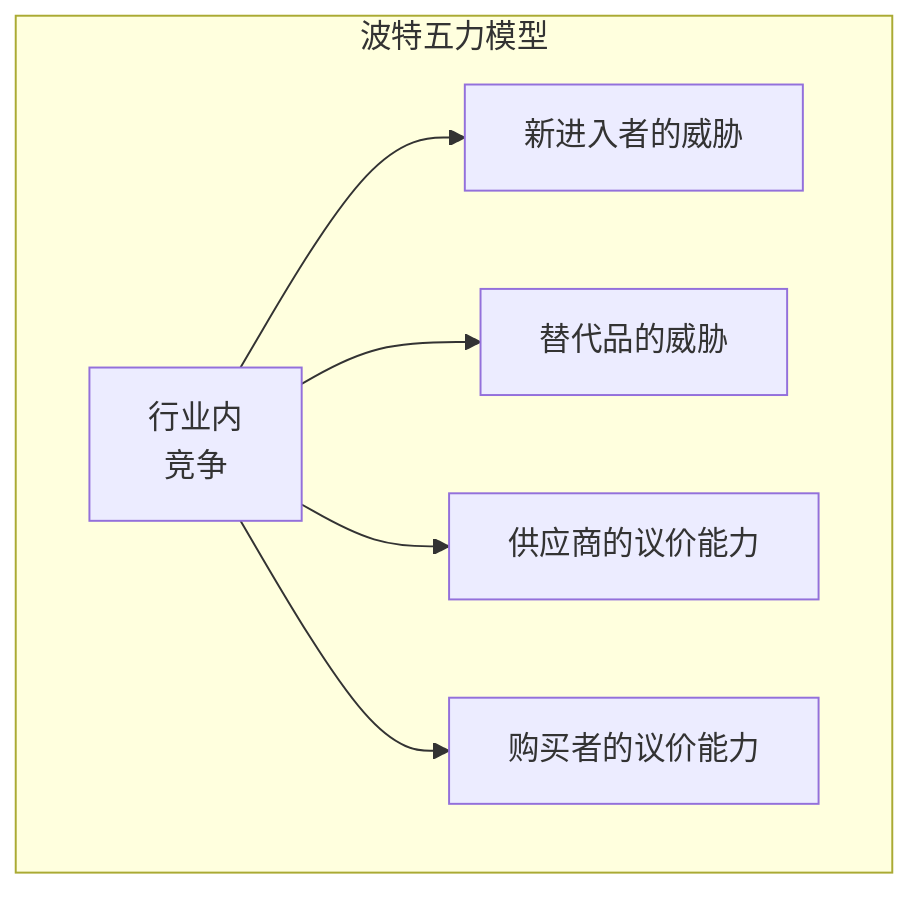

竞争不是为了打败对手，而是为了获取利润。

竞争战略有目的的选择一整套不同的运营活动，以创造一种独特的价值定位。

战略定位是一种独特的经营活动，带来三个结果：
1. 独特的价值
2. 总成本领先
3. 竞争对手难以模仿

---

## 二、品牌战略

### 2.1 品牌三大原理

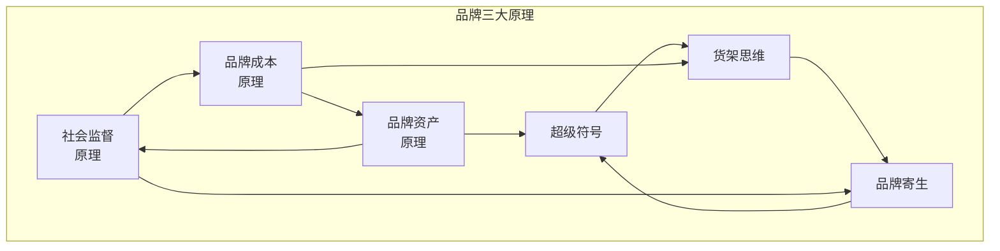

**社会监督原理**
- 品牌是手段，社会是目的
- 从经济学角度看，品牌是一种博弈的机制，是企业为了赢得顾客的选择，给顾客惩罚自己的机会，而创造的一种重复博弈的机制

**品牌成本原理**
- 品牌存在的意义在于降低三个成本：
  1. 降低社会监督成本
  2. 降低顾客选择成本
  3. 降低企业的营销传播成本

**品牌资产原理**
- 品牌资产就是给企业带来效益的消费者品牌认知
- 做任何一件事，一切以是否形成资产、保护资产、增值资产为标准
- 品牌资产的两个效益：买我东西，传我美名

---

### 2.2 品牌三角形

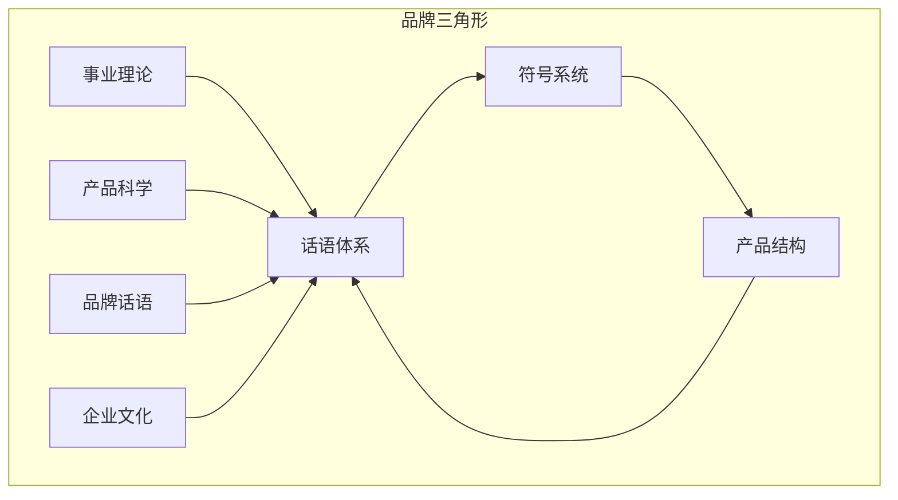

**产品结构**：产品是品牌的本源。不管是物理意义的产品还是服务产品，甚至思想上的产品，一定是先有产品才会有品牌

**话语体系**：有产品就一定会有产品命名、产品定义，这个命名和定义就是品牌的话语体系，是品牌的文本传达

**符号系统**：每个产品或品牌，它都有感官上的体验。这些品牌的感官信号就是它的符号系统

---

### 2.3 产品战略围棋模型

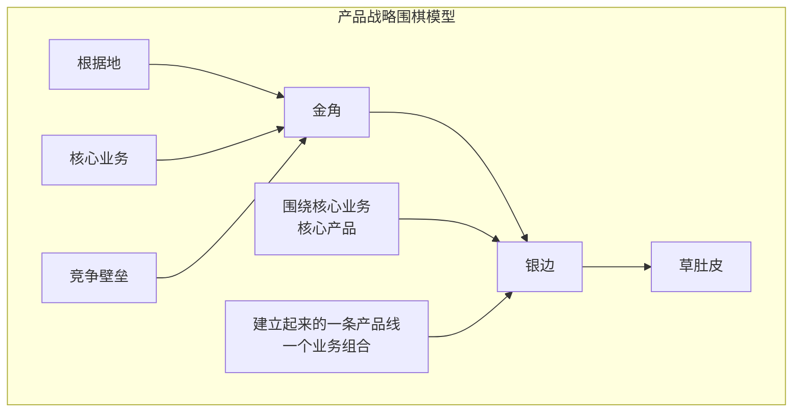

我们把决战目标称为战略，把达到这一目标的一系列会战称为路线图。这就是整个战略计划。

- **金角** 是根据地，是核心业务，是竞争壁垒
- **银边** 是围绕一个核心业务、核心产品，建立起来的一条产品线，一个业务组合
- **草肚皮** 是我们的品牌势能最终能覆盖的业务范围。在围棋棋盘的中间，是一把"战略镰刀"，用战略布局建立品牌，最后在整个品类收割草肚皮，获得边际效益的最大化——草肚皮效益

---

## 三、传播

### 3.1 传播三大原理

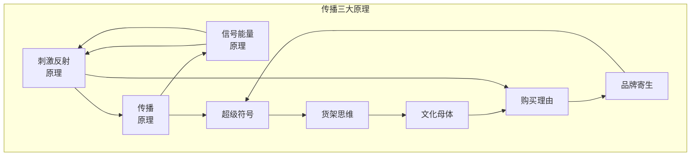

**刺激反射原理**
- 人的一切行为都是刺激反射行为，所有的传播都是自我释放出一个刺激信号，谋求顾客的一个行动反射

**传播原理**
- 传播的本质不是"传播"，而是"播传"
- 是"播"出去，发动消费者替我们"传"
- 顾客替我们传，就是从向我们"买"，到替我们"卖"

**信号能量原理**
- 刺激信号的能量越强，则行动反射越大
- 放大刺激信号是华与华方法的核心

---

### 3.2 超级符号原理

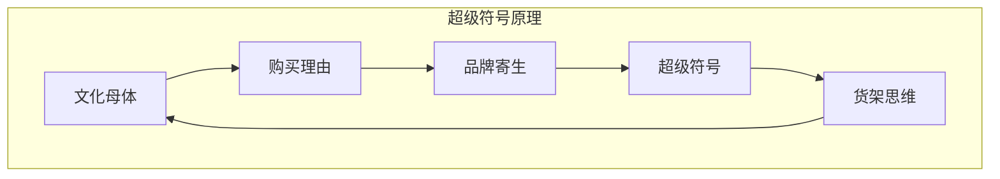

**文化母体**：是人类生活中循环往复的部分。母体必将循环往复地发生，母体一旦循环至此，购买必将发生

**购买理由**：是心理上的打动机制。购买理由就是对暗号，是对母体中的人说话，引起他的注意，并触发母体行为，达成购买

**超级符号**：一切产品的任何价值都可以通过符号来表达。超级符号是对购买理由的放大，它来源于文化母体，是和购买理由一起实现品牌寄生的

**货架思维**：商品或品牌的信息和消费者发生沟通的地方，都称之为货架。货架意识就是无时无刻不意识到货架

---

### 3.3 文化母体四步曲

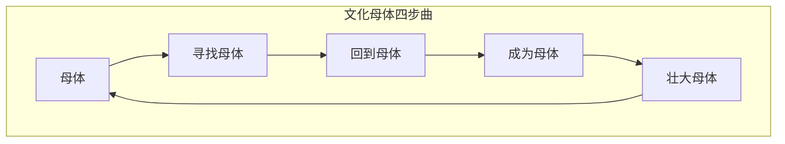

| 步骤 | 说明 |
|-----|------|
| 第一步：寻找母体 | 找到一个母体行为或风俗 |
| 第二步：回到母体 | 使用母体符号 |
| 第三步：成为母体 | 成为原母体的新母体 |
| 第四步：壮大母体 | 活进文化母体，成为人类风俗 |

---

## 附录：模型索引

| 章节 | 模型名称 | 核心概念 |
|-----|---------|---------|
| 1.1 | 企业三大原理 | 科斯交易成本、德鲁克社会职能、熊彼特创新利润 |
| 1.2 | 企业战略菱形模型 | 社会问题→业务战略→经营活动→经营使命 |
| 1.3 | 五个市场模型 | 顾客/人才/政策/公众/资本市场 |
| 1.4 | 企业价值之轮 | 梦想→知识→服务→产品→体验 |
| 1.5 | 企业战略三角 | 拳头产品×权威专家×梦想化身 |
| 1.6 | 企业价值三角 | 先进生产力×先进文化×人民利益 |
| 1.7 | 定位坐标系 | 产品×消费者×行业史 |
| 1.8 | 顾客价值方阵 | 做什么×体验什么×学到什么×成为什么 |
| 1.9 | 熊彼特五个创新 | 产品/技术/市场/原料/组织创新 |
| 1.10 | 波特五力模型 | 新进入者/替代品/供应商/购买者/行业内竞争 |
| 2.1 | 品牌三大原理 | 社会监督/品牌成本/品牌资产 |
| 2.2 | 品牌三角形 | 话语体系×符号系统×产品结构 |
| 2.3 | 产品战略围棋模型 | 金角×银边×草肚皮 |
| 3.1 | 传播三大原理 | 刺激反射/传播/信号能量 |
| 3.2 | 超级符号原理 | 文化母体→购买理由→品牌寄生→超级符号→货架思维 |
| 3.3 | 文化母体四步曲 | 寻找→回到→成为→壮大 |
